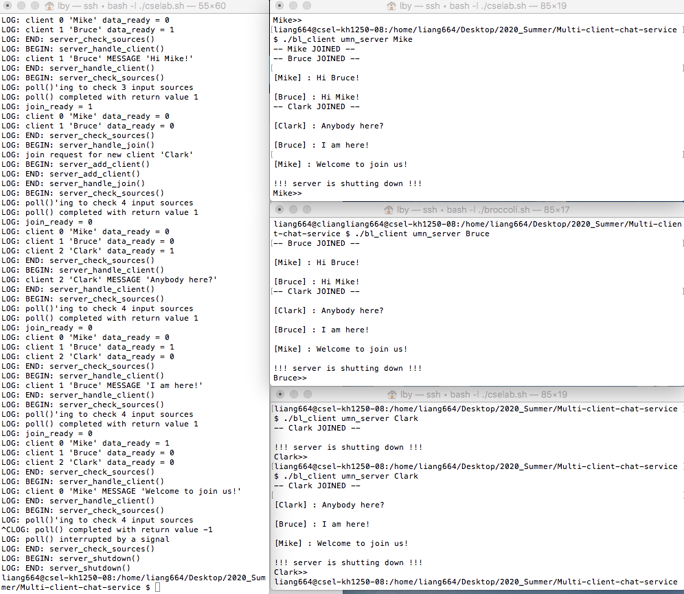

## Multi-client chat service
The main goal of this chat service is to achieve inter-process communication (between server and clients) through FIFOs. 

## Table of contents
* [General Information](#general-information)
* [File Description](#file-description)
* [Screenshots](#screen-shots)
* [Code Examples](#code-examples)
* [Contact](#contact)

## General Information
This project includes two parts:

**Server**

server starts the bl_server to manage the chatroom. The server is non-iterative.

**Client**

User who wants to chat could run the bl_client which takes input typed on the keyboard and sends it to the server. The server broadcasts the input to all other clients who can respond by typing their own input.

The key parts of this project includes:

1. Multiple communicating processes: clients to servers Communication through FIFOs
2. Signal handling for graceful server shutdown
3. Alarm signals for periodic behavior
4. Input multiplexing with poll()
5. Multiple threads in the client to handle typed input versus info from the server

## File Description
*Makefile* is used for building project and running tests;

*server_funcs.c* contains service routines for the server;

*bl_server.c* is the main function for bl_server executable;

*bl_client.c* is the main function for bl_client executable;

*blather.h* is the header file which contains required structs, defines, and prototypes;

*util.c* contains utility methods debug messages and checking system call returns;

*simpio.c* is the simplified terminal I/O to get nice interactive sessions;

*simpio_demo.c* is used for demostrating simpio features, model for bl_client.c.

## Screen Shots
This screenshot is to show the output of server and several clients mid-chat.

The the server umn_server is started in the leftside large terminal and shows the output about current process.

There are 3 clients who log into the server and specfify their name to be Bruce, Mike and Clark.



## Code Examples
To build the executable program bl_server and bl_client, run:
```bash
make
```
which will give the following results:
```bash
gcc -Wall -g  -c bl_server.c
gcc -Wall -g  -c server_funcs.c
gcc -Wall -g  -c util.c
gcc -Wall -g  -o bl_server  bl_server.o server_funcs.o  util.o
bl_server is ready
gcc -Wall -g  -c bl_client.c
gcc -Wall -g  -c simpio.c
gcc -Wall -g  -o bl_client bl_client.o simpio.o util.o -lpthread 
bl_client is ready
```
Run the command: 
```bash
./bl_server <server_name>
```
for example, 
```bash
./bl_server umn_server
```
The umn_server will start a chat room with following output
```bash
LOG: BEGIN: server_start()
LOG: END: server_start()
LOG: BEGIN: server_check_sources()
LOG: poll()'ing to check 1 input sources
```
Run the command: 
```bash
./bl_client <server_name> <client_name>
```
for example, 
```bash
./bl_client umn_server Bruce
```
The umn_client will join the chat room. The server side will give the following output
```bash
LOG: poll() completed with return value 1
LOG: join_ready = 1
LOG: END: server_check_sources()
LOG: BEGIN: server_handle_join()
LOG: join request for new client 'Bruce'
LOG: BEGIN: server_add_client()
LOG: END: server_add_client()
LOG: END: server_handle_join()
LOG: BEGIN: server_check_sources()
LOG: poll()'ing to check 2 input sources
```

The client side will give the following output
```bash
-- Bruce JOINED --
Bruce>>
```
Using the same method, more clients could join the same server. The client can type the intput on the keyboard and send to the server, and the server will broadcast the message to all the other clients.
 
## Contact
Created by Buyun Liang [liang664@umn.edu] (https://www.linkedin.com/in/buyun-liang/) and Rick Wang - feel free to contact me if you have any questions!
